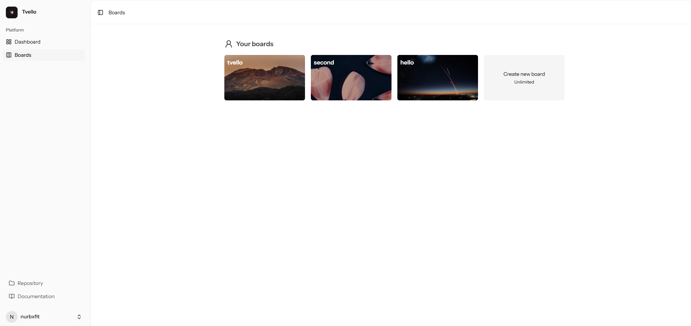
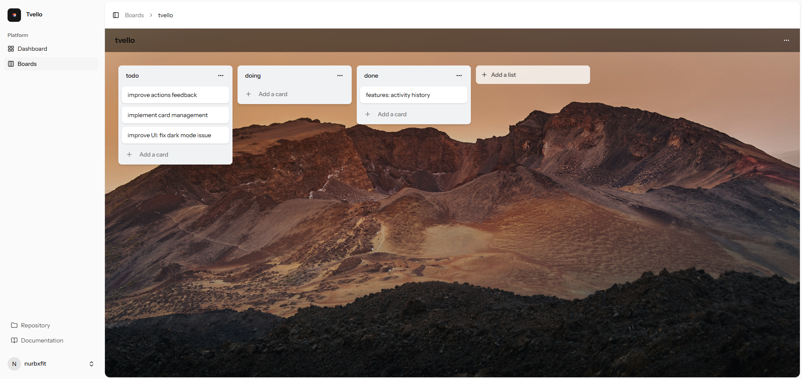
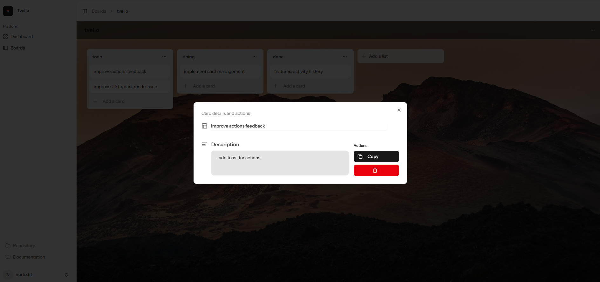

# Tvello – Open Source Trello Clone


**Tvello** is a minimal Trello-like task board built with **Laravel**, **React**, and **Inertia.js**.  
Lightweight, easy to run locally with **SQLite**, and perfect for learning or small projects.

---

## ✨ Features

- 🔐 User authentication  
- 📋 Create and manage boards  
- 📝 Add and organize tasks inside boards  
- 🔄 Basic CRUD functionality  
- ⚡ SPA-like experience powered by Inertia.js  
- 🎨 TailwindCSS styling  

---

## 🖼️ Screenshots

Boards overview page  


Board with lists & cards  


Card detail modal  


---

## 🛠️ Tech Stack

- [Laravel](https://laravel.com/) – Backend framework  
- [React](https://react.dev/) – Frontend library  
- [Inertia.js](https://inertiajs.com/) – SPA bridge  
- [TailwindCSS](https://tailwindcss.com/) – Styling  
- [SQLite](https://www.sqlite.org/) – Local database  

---

## 🚀 Getting Started

Clone the repo:

```bash
git clone https://github.com/nurbxfit/tvello.git
cd tvello

```
Install dependencies:

```bash
composer install
npm install
```
Run migrations:
```bash
php artisan migrate
```

Start the dev servers:
```bash
php artisan serve
```
or
```bash
composer run dev
```

Now open http://localhost:8000

## 📌 Notes

This is mainly a learning project exploring the Laravel + React + Inertia full-stack workflow.
It’s simple by design, but you can fork and expand it however you like.